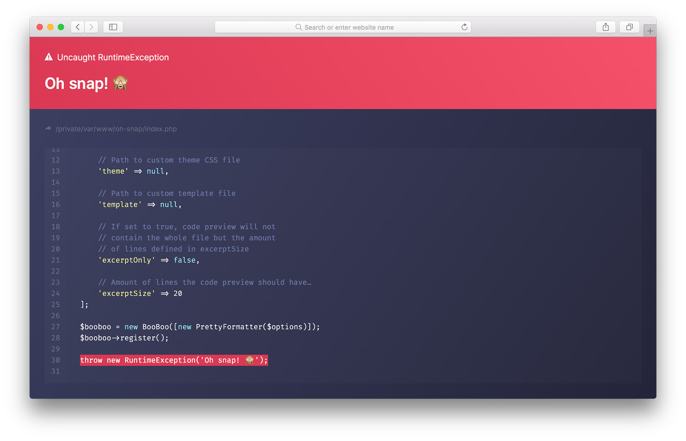

<h3 align="center">💥 Oh Snap!</h3>
<p align="center">A pretty formatter for <a href="https://github.com/thephpleague/booboo">BooBoo</a>.</p><br><br>

## Installation

It is recommended that you install this library using [Composer].

```bash
composer require mzdr/oh-snap
```

Don’t forget to check out the official documentation of [BooBoo] on how to use and install it.

<br>

## Usage

```php
<?php

require __DIR__ . '/vendor/autoload.php';

use League\BooBoo\BooBoo;
use mzdr\OhSnap\Formatter\PrettyFormatter;

// Options array for adjusting formatter behaviour.
// Default values are shown below.
$options = [

    // List of CSS files to include in the (default) template.
    'theme' => ['default'],

    // Path to custom template file.
    'template' => null,

    // If set to true, code preview will not contain the
    // whole file but the amount of lines defined in excerptSize.
    'excerptOnly' => false,

    // Amount of lines the code preview should have…
    'excerptSize' => 20,

    // Optional header/footer content to show. May be a path
    // to a file that should be required. Output will not be
    // sanitized in any way.
    'header' => null,
    'footer' => null
];

$booboo = new BooBoo([new PrettyFormatter($options)]);
$booboo->register();

throw new RuntimeException('Oh snap! 🙈');
```

<br>

## Customizing

You may customize the formatter in **3** different ways.

<br><table><tr><td>**Fully** 🤓</td></tr></table>

If you want **full** control over the output of the formatter, you’ll probably need to use a custom template. This is preferably a `.php` file since it’s going to be `require()'d` and it’s output will be returned to BooBoo.

Just keep in mind, if you do so, you are going to start from scratch. Check out the [default template] for inspiration. 🌟

<br><table><tr><td>**Partially** 💄</td></tr></table>

If you just want to **repaint** the default template this is the way to go. You either can use a completely new CSS file _or_ append one.

```php
<?php

$options = [

    // Building on top of default styles…
    'theme' => ['default', 'path/to/your.css', 'a { color: pink; }'],

    // Using different stylesheet…
    'theme' => ['path/to/your.css'],

    // Using no styles at all? ¯\_(ツ)_/¯
    'theme' => [],
];
```

<br><table><tr><td>**Slightly** ✍️</td></tr></table>

Maybe the `header` and/or `footer` options are just enough? They will be placed inside the respective elements (e.g. `<header class="header-panel"><?= $header ?></header>`) of the **default** template, _or_ your custom template _if_ you implement it. You may pass **any** string you like, including HTML. Perfect for just a little branding.

<br>

## License

This project is licensed under [MIT license].

[BooBoo]: https://github.com/thephpleague/booboo
[Composer]: https://getcomposer.org/doc/00-intro.md
[MIT license]: ./LICENSE
[default template]: ./templates/default/default.php
